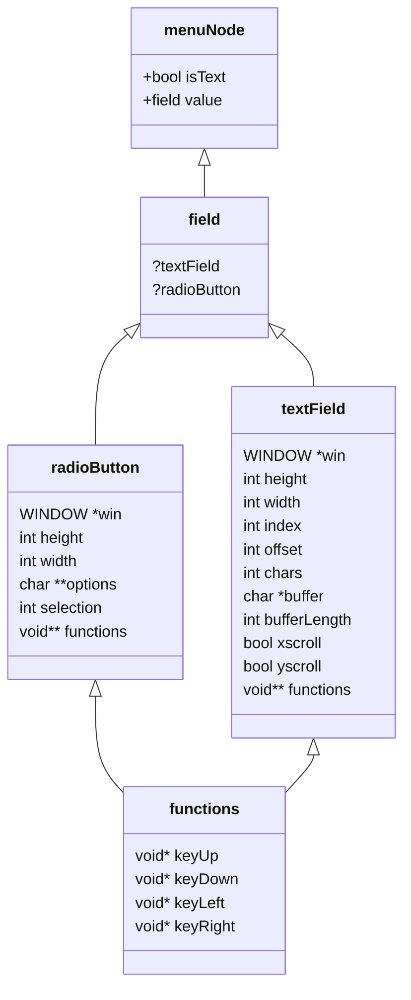

# tiny-board

```mermaid
classDiagram
    class menuNode
    menuNode: +bool isText
    menuNode: +field value
    menuNode <|-- field
    field: ?textField
    field: ?radioButton 
    field <|-- textField
    field <|-- radioButton
    radioButton <|-- functions
    textField <|-- functions
    textField: WINDOW *win
    textField: int height
    textField: int width
    textField: int index
    textField: int offset
    textField: int chars
    textField: char *buffer
    textField: int bufferLength
    textField: bool xscroll
    textField: bool yscroll
    textField: void** functions

    radioButton: WINDOW *win 
    radioButton: int height
    radioButton: int width
    radioButton: char **options
    radioButton: int selection
    radioButton: void** functions

    functions: void* keyUp
    functions: void* keyDown
    functions: void* keyLeft
    functions: void* keyRight
```
